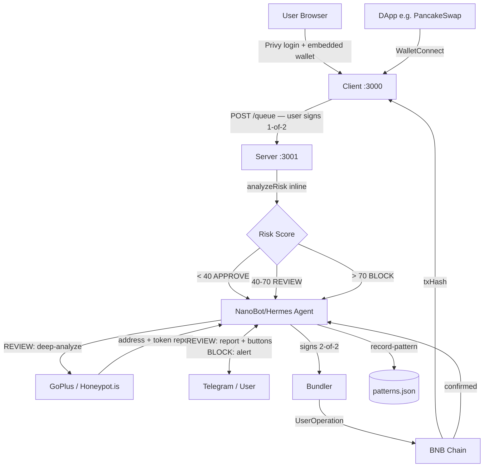
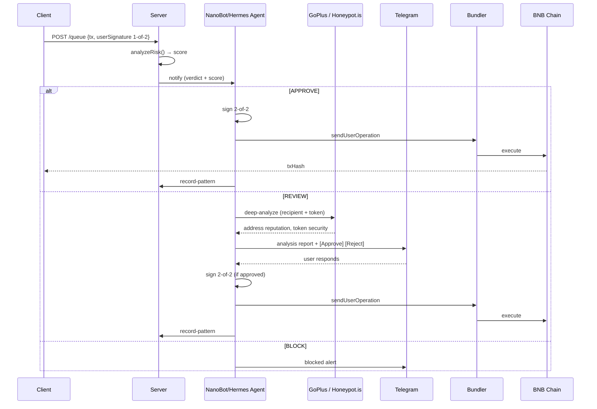

## Components

| Component | Role |
|-----------|------|
| `client/` | Next.js 14 frontend — onboarding, dashboard, send/receive, WalletConnect, invoices |
| `server/` | Express API — inline risk analysis, queue management, Zerion portfolio |
| `agent/` | NanoBot/Hermes skill pack — Telegram commands, deep analysis, 2nd signature, pattern recording |

## Client

- **Next.js 14** App Router, React 18, TypeScript, Tailwind CSS, Framer Motion
- **Privy** for Google OAuth + embedded wallet creation
- Deploys a Safe 2-of-2 smart account per user (owner = user's embedded wallet, co-signer = agent address)
- Signs 1-of-2, then POSTs to `/queue`
- **WalletConnect v2** — acts as a wallet for DApps; requests flow through the same pipeline
- **Portfolio** via Zerion API (live balances, prices, 24h change)

## Server

- **Express** with TypeScript (`tsx` for dev, PM2 for production)
- Runs `analyzeRisk()` inline on every `/queue` request — no async roundtrip
- File-based JSON storage shared with the agent

## Agent

- **NanoBot/Hermes skill pack** — holds the 2nd signing key
- Responds to Telegram commands from the owner
- Runs deep analysis (GoPlus + Honeypot.is) on REVIEW-tier transactions
- Records patterns after every confirmed transaction

## Data Flow

## State Files

| File | Purpose |
|------|---------|
| `pending-queue.json` | Queued transactions awaiting processing |
| `invoice-queue.json` | Pending invoice requests |
| `state.json` | Screening mode and agent decisions |
| `patterns.json` | Learned behavioral patterns |

## Tech Stack

| Layer | Technology |
|-------|-----------|
| Chain | BNB Chain (BSC), Chain ID 56 |
| Smart Account | Safe 1.4.1 + ERC-4337 (EntryPoint v0.7) |
| Bundler/Paymaster | Pimlico (gasless) |
| Frontend | Next.js 14, React 18, TypeScript, Tailwind CSS, Framer Motion |
| Auth | Privy (embedded wallets + Google OAuth) |
| Blockchain libs | viem, permissionless.js |
| Backend | Express, tsx (dev), PM2 (production) |
| AI Agent | NanoBot/Hermes with Qwen3-235B / Claude Sonnet 4.5 via OpenRouter |
