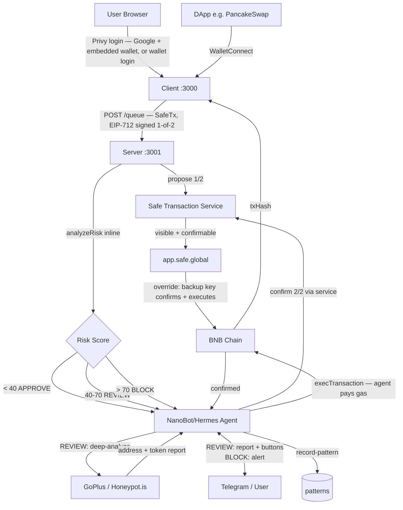
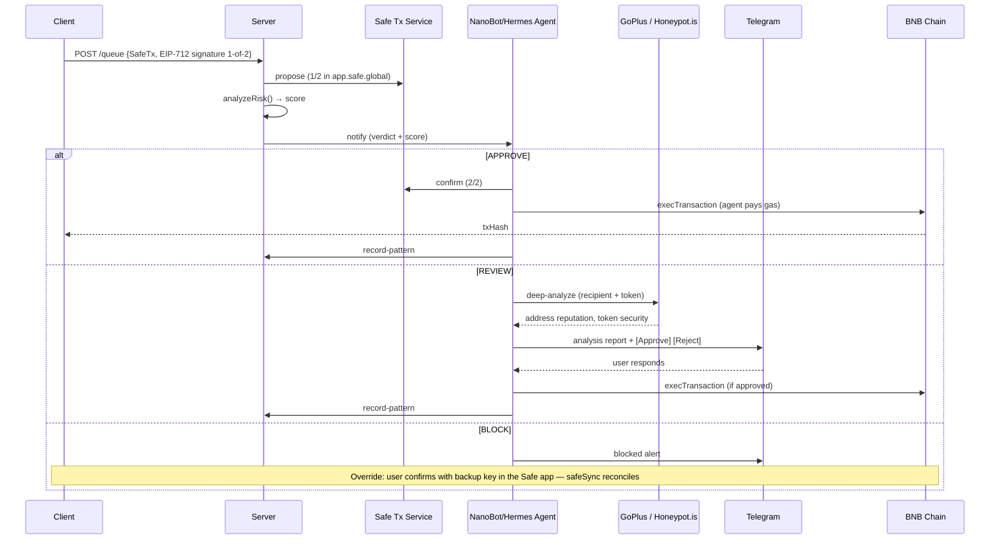

## Components

| Component | Role |
|-----------|------|
| `client/` | Next.js 14 frontend — onboarding, wallet profiles, dashboard, send/swap, WalletConnect, invoices |
| `server/` | Express API — inline risk analysis, queue management, Safe Transaction Service integration, address derivation, relay execution, Zerion portfolio |
| `agent/` | NanoBot/Hermes skill pack — Telegram commands, deep analysis, screening decisions, pattern recording |

## Client

- **Next.js 14** App Router, React 18, TypeScript, Tailwind CSS, Framer Motion
- **Privy** auth — Google OAuth + embedded wallet, or **wallet login** (MetaMask / Rabby as the signing key), plus a signature-free backup-key link
- Wallets are Safe multisigs with [computed profiles](/technology/signing#wallet-profiles) — starter / guarded / protected / detached
- Signs standard SafeTxs (EIP-712), 1 of the threshold, then POSTs to `/queue`
- **WalletConnect v2** — acts as a wallet for DApps; requests flow through the same pipeline
- **Portfolio** via Zerion API (live balances, prices, 24h change)

## Server

- **Express** with TypeScript (`tsx` for dev, PM2 for production)
- Runs `analyzeRisk()` inline on every `/queue` request — no async roundtrip
- **Hard-validates every proposal**: signature recovery against the recorded owner set, threshold arithmetic for screening-off, and owner-management transitions
- Mirrors every proposal to the **Safe Transaction Service** so it appears in app.safe.global at 1/2; a `safeSync` worker reconciles transactions confirmed or executed there directly
- **Relays execution**: the agent EOA submits `execTransaction` and pays BNB gas — relay-only (no agent signature) whenever user signatures meet the threshold
- Derives addresses server-side through a [versioned registry](/technology/signing#address-derivation); user records and transactions persist in Supabase (Postgres)

## Agent

- **NanoBot/Hermes skill pack** — holds the agent owner key
- Responds to Telegram commands from the owner
- Runs deep analysis (GoPlus + Honeypot.is) on REVIEW-tier transactions
- Records patterns after every confirmed transaction
- **Never signs unscreened transactions** — with screening off it either relays only (v2) or, for [legacy v1 accounts](/technology/legacy), co-signs by explicit exemption

## Data Flow

Rejections execute a **pre-signed empty transaction at the same nonce**, so a rejected proposal never leaves a nonce hole blocking later transactions.

## State

| Store | Purpose |
|-------|---------|
| Supabase (Postgres) | User records (owner sets, thresholds, immutable creation snapshots), transaction queue and outcomes |
| Safe Transaction Service | Proposal mirror — the source the Safe app reads and writes |
| `state.json` | Screening mode and agent decisions (agent runtime) |
| `patterns.json` | Learned behavioral patterns (agent runtime) |

## Tech Stack

| Layer | Technology |
|-------|-----------|
| Chain | BNB Chain (BSC), Chain ID 56 |
| Smart Account | Safe 1.4.1 multisig — standard SafeTx flow via the Safe Transaction Service |
| Gas | Agent EOA relays `execTransaction` and pays BNB (ERC-4337/Pimlico survives only for legacy queued rows) |
| Frontend | Next.js 14, React 18, TypeScript, Tailwind CSS, Framer Motion |
| Auth | Privy (Google OAuth + embedded wallets, wallet login, backup-key linking) |
| Blockchain libs | viem, @safe-global/protocol-kit + api-kit |
| Backend | Express, Supabase (Postgres), tsx (dev), PM2 (production) |
| AI Agent | NanoBot/Hermes with Qwen3-235B / Claude Sonnet 4.5 via OpenRouter |
