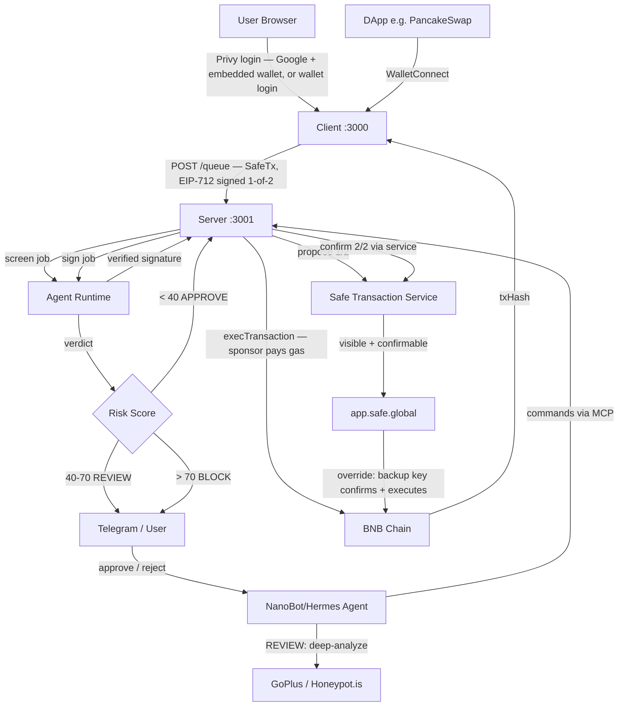
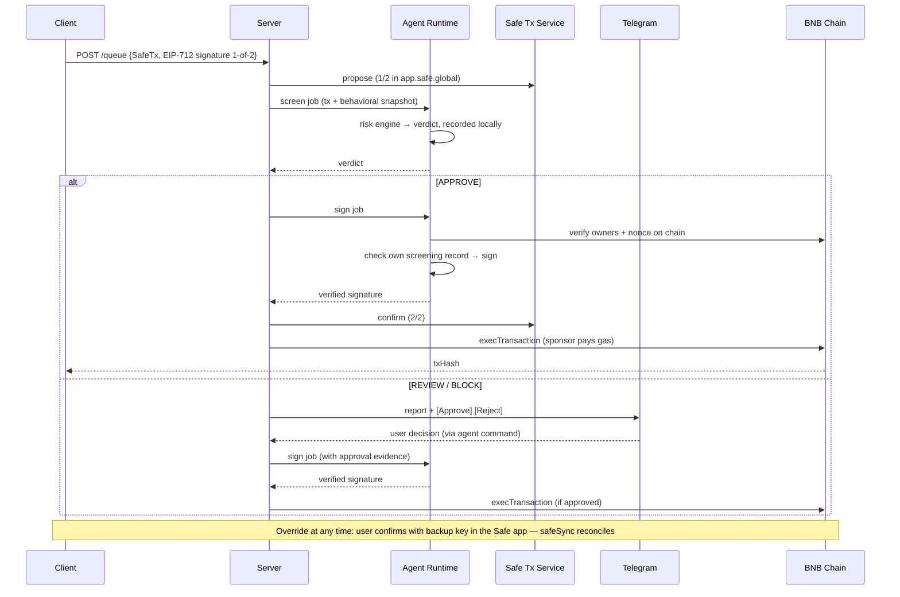

## Components

| Component | Role |
|-----------|------|
| `client/` | Next.js 14 frontend — onboarding, wallet profiles, dashboard, send/swap, WalletConnect, invoices |
| `server/` | Express API — canonical state, proposal validation, Safe Transaction Service integration, address derivation, notifications, sponsor relay, Zerion portfolio. **Holds no signing key.** |
| `runtime/` | The agent runtime — a separate worker process that **screens every transaction and holds the only signing key**. Pulls work from the server over an authenticated API; has no database access and accepts no inbound connections |
| `screening/` | Pure risk engine shared by server and runtime — same code, same decision, wherever it runs |
| `agent/` | NanoBot/Hermes skill pack — the conversational layer: Telegram commands, deep analysis, review dialogue. **Holds no keys** |

```mermaid
flowchart TD
    U[User Browser] -->|Privy login — Google + embedded wallet, or wallet login| C[Client :3000]
    D[DApp e.g. PancakeSwap] -->|WalletConnect| C
    C -->|POST /queue — SafeTx, EIP-712 signed 1-of-2| S[Server :3001]
    S -->|propose 1/2| TS[Safe Transaction Service]
    TS -->|visible + confirmable| SA[app.safe.global]
    S -->|screen job| RT[Agent Runtime]
    RT -->|verdict| R{Risk Score}
    R -->|< 40 APPROVE| S
    R -->|40-70 REVIEW| TG[Telegram / User]
    R -->|> 70 BLOCK| TG
    TG -->|approve / reject| OC[NanoBot/Hermes Agent]
    OC -->|commands via MCP| S
    OC -->|REVIEW: deep-analyze| EXT[GoPlus / Honeypot.is]
    S -->|sign job| RT
    RT -->|verified signature| S
    S -->|confirm 2/2 via service| TS
    S -->|execTransaction — sponsor pays gas| BC[BNB Chain]
    SA -->|override: backup key confirms + executes| BC
    BC -->|txHash| C
```

## Client

- **Next.js 14** App Router, React 18, TypeScript, Tailwind CSS, Framer Motion
- **Privy** auth — Google OAuth + embedded wallet, or **wallet login** (MetaMask / Rabby as the signing key), plus a signature-free backup-key link
- Wallets are Safe multisigs with [computed profiles](/technology/signing#wallet-profiles) — starter / guarded / protected / detached
- Signs standard SafeTxs (EIP-712), 1 of the threshold, then POSTs to `/queue`
- **WalletConnect v2** — acts as a wallet for DApps; requests flow through the same pipeline
- **Portfolio** via Zerion API (live balances, prices, 24h change)

## Server

- **Express** with TypeScript (`tsx` for dev, PM2 for production)
- Owns **canonical state**: user records, the transaction queue, notifications (Telegram + email), and the Supabase (Postgres) database — the runtime never touches any of these directly
- **Hard-validates every proposal**: signature recovery against the recorded owner set, threshold arithmetic for screening-off, and owner-management transitions
- Sends every screening and signing request to the runtime as a **job** over the Runtime API (bearer-authenticated, fail-closed) and applies the verdicts that come back — exactly once, atomically
- Mirrors every proposal to the **Safe Transaction Service** so it appears in app.safe.global at 1/2; a `safeSync` worker reconciles transactions confirmed or executed there directly
- **Relays execution**: a dedicated sponsor EOA submits `execTransaction` and pays BNB gas — relay-only (no agent signature) whenever user signatures meet the threshold
- Derives addresses server-side through a [versioned registry](/technology/signing#address-derivation)

## Agent Runtime

- A **separate worker process** — the security core of the system
- **Screens** every proposal with the shared risk engine, from inputs the server assembles into the job itself
- **Holds the only signing key**, behind a verifying authority: before signing anything it independently recomputes the transaction hash, reads the Safe's owners and nonce **from chain**, and requires **its own record of having screened this exact transaction** — a claim in the request is not evidence
- Keeps its own append-only decision log; has **no database credential** and opens no inbound port (a localhost health endpoint is its only listener)
- **Fail-closed**: if the runtime is down, screened transactions simply wait — nothing executes without a verdict, and flows that never need the agent's signature (relay-only, backup co-sign) continue unaffected

## Conversational Agent

- **NanoBot/Hermes skill pack** — Telegram commands, review dialogue, deep analysis (GoPlus + Honeypot.is) on REVIEW-tier transactions
- Sends every command through the server's authenticated API (via MCP) — it holds no keys and touches no state directly

## Data Flow

```mermaid
sequenceDiagram
    participant C as Client
    participant S as Server
    participant RT as Agent Runtime
    participant TS as Safe Tx Service
    participant TG as Telegram
    participant BC as BNB Chain

    C->>S: POST /queue {SafeTx, EIP-712 signature 1-of-2}
    S->>TS: propose (1/2 in app.safe.global)
    S->>RT: screen job (tx + behavioral snapshot)
    RT->>RT: risk engine → verdict, recorded locally
    RT-->>S: verdict
    alt APPROVE
        S->>RT: sign job
        RT->>BC: verify owners + nonce on chain
        RT->>RT: check own screening record → sign
        RT-->>S: verified signature
        S->>TS: confirm (2/2)
        S->>BC: execTransaction (sponsor pays gas)
        BC-->>C: txHash
    else REVIEW / BLOCK
        S->>TG: report + [Approve] [Reject]
        TG-->>S: user decision (via agent command)
        S->>RT: sign job (with approval evidence)
        RT-->>S: verified signature
        S->>BC: execTransaction (if approved)
    end
    Note over C,BC: Override at any time: user confirms with backup key in the Safe app — safeSync reconciles
```

Rejections execute a **pre-signed empty transaction at the same nonce**, so a rejected proposal never leaves a nonce hole blocking later transactions — the cancel's agent signature comes from the runtime like any other.

## State

| Store | Purpose |
|-------|---------|
| Supabase (Postgres) | User records (owner sets, thresholds, immutable creation snapshots), transaction queue and outcomes, screening/signing job queue — **server-only access** |
| Safe Transaction Service | Proposal mirror — the source the Safe app reads and writes |
| Runtime decision log | Append-only record of every screening decision, kept by the runtime itself — what the signing authority verifies against |

## Tech Stack

| Layer | Technology |
|-------|-----------|
| Chain | BNB Chain (BSC), Chain ID 56 |
| Smart Account | Safe 1.4.1 multisig — standard SafeTx flow via the Safe Transaction Service |
| Gas | Sponsor EOA relays `execTransaction` and pays BNB |
| Frontend | Next.js 14, React 18, TypeScript, Tailwind CSS, Framer Motion |
| Auth | Privy (Google OAuth + embedded wallets, wallet login, backup-key linking) |
| Blockchain libs | viem, @safe-global/protocol-kit + api-kit |
| Backend | Express, Supabase (Postgres), tsx (dev), PM2 (production) |
| Agent runtime | Node worker (PM2), shared `zhentan-screening` risk core, viem for chain verification |
| AI Agent | NanoBot/Hermes with Qwen3-235B / Claude Sonnet 4.5 via OpenRouter |
