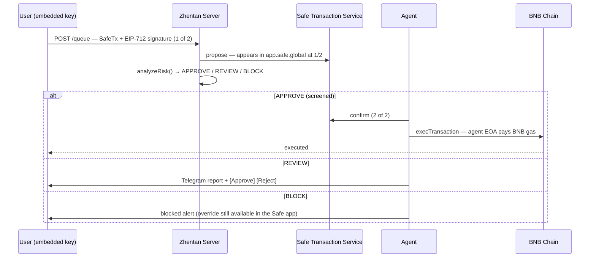

Zhentan wallets are Safe multisigs where **the user always holds the majority of keys**. The agent co-signs and pays gas, but it can never move funds alone — and in the full model, it can't stop you either.

## The 2-of-3 Model

A fully set up Zhentan wallet has three owners and a threshold of 2:

| Owner | Held by | Role |
|-------|---------|------|
| **Embedded key** | You (Privy embedded wallet, or your connected wallet for wallet login) | Proposes and signs every transaction |
| **Backup key** | You (any external wallet — pasted address, ENS/.bnb name, or connected) | Your override and recovery key |
| **Agent key** | Zhentan agent | Screens, co-signs approved transactions, relays and pays gas |

Your two keys meet the threshold — so the agent is an **advisory speed bump, not a gatekeeper**. If it ever blocks something you want (or disappears entirely), you can execute from [app.safe.global](https://app.safe.global) with your embedded + backup keys and go around it.

<Note>
**Two hard invariants**, enforced server-side on every proposal:

1. The agent **never reaches the threshold alone** — it cannot move funds without you.
2. The agent **never signs a transaction it didn't screen** — when screening is off, your own keys must meet the threshold and the agent only relays.
</Note>

## Wallet Profiles

Profiles are **computed from the live owner set and threshold** — never stored. Every wallet is exactly one of:

| Profile | Owners | Threshold | Screening | Notes |
|---------|--------|-----------|-----------|-------|
| **Starter** | `[embedded]` | 1 | Unavailable | Instant onboarding. Your signature alone executes; the agent relays and pays gas without signing. |
| **Guarded** | `[embedded, agent]` | 2 | Structurally mandatory | Your key can't reach the threshold alone, so screening can't be turned off. Lockout risk is disclosed at creation; the app persistently nudges you to add a backup key. |
| **Protected** | `[embedded, backup, agent]` | 2 | On by default, toggleable | The full model. Your two keys meet the threshold — screening is a choice, and the Safe-app override is always available. |
| **Detached** | `[embedded, backup]` | 2 | None | Exit state. "Detach Zhentan" removes the agent — same address, stock Safe. |

### Transitions

All transitions are hard-validated owner-management SafeTxs **on the same address** — your Safe address never changes:

| From → To | Mechanism |
|-----------|-----------|
| Starter → Guarded | Add agent + raise threshold |
| Starter → Protected | Atomic MultiSend batch — never passes through an unmanaged intermediate state |
| Guarded → Protected | `addOwnerWithThreshold(backup)` |
| Protected → Detached | Remove agent (the exit) |

Every account keeps an **immutable creation snapshot** (creation owners, threshold, salt nonce, derivation version — frozen by a database trigger), so its address stays re-derivable forever even after transitions rewrite the live owner set.

## Transaction Flow

Every user transaction is a standard Safe transaction (EIP-712 SafeTx) — visible and actionable in the official Safe app at every stage:

Key properties:

- **The agent relays and pays gas.** Users never need BNB — the agent EOA submits `execTransaction` on-chain.
- **Rejections never leave nonce holes.** Every proposal pre-signs a same-nonce empty cancel transaction, so a rejection consumes the nonce cleanly and later proposals aren't blocked.
- **The Safe app is a first-class surface.** A sync worker reconciles transactions confirmed or executed directly from app.safe.global — the override path is fully supported, not an afterthought.

## Relay-Only Execution

Whenever your own signatures meet the threshold, the agent contributes **no signature** — it only submits the transaction and pays gas:

- **Starter** (threshold 1): your signature alone.
- **Protected with screening off**: your embedded + backup signatures.

This is what makes "the agent never signs what it didn't screen" enforceable rather than aspirational.

## Screening Off: Queue and Co-Sign

In a Protected wallet you can pause screening. Your transactions then need **both of your keys**:

1. You propose and sign as usual — the transaction queues at **1 of 2** and is mirrored to the Safe Transaction Service.
2. Complete it whenever you like, from either surface:
   - **In-app** — open the transaction in your history and tap **Sign with [your backup wallet]**. If the backup wallet isn't connected, the app walks you through a signature-free connection first. The agent then relay-executes.
   - **Safe app** — confirm with your backup key at app.safe.global; Zhentan's sync worker picks up the execution automatically.

Guarded wallets **cannot** turn screening off — one user key against a threshold of two means no second signature could ever exist. The server rejects such proposals outright with a prompt to add a backup key first. (Legacy v1 accounts are the one exception — see [Legacy Accounts](/technology/legacy).)

## Address Derivation

Safe addresses are derived **server-side only**, through a versioned registry:

| Version | Recipe | Who |
|---------|--------|-----|
| **v1** | Legacy permissionless initializer with the Safe4337Module enabled | All pre-refactor accounts, pinned forever |
| **v2** | Vanilla stock Safe (protocol-kit initializer, CompatibilityFallbackHandler, no modules) | Default for all new accounts |

The client never derives locally — it asks `GET /users/by-signer` (returning users) or `POST /safe/derive` (new users, with their chosen profile). Owner order for derivation is canonical `[embedded, backup, agent]`; deployed Safes read their live owner set from chain. Derivation runs **once at account creation**; the frozen creation snapshot keeps every address auditable and re-derivable — the server ships `safe:verify-derivations` to re-derive and check every account.

Safes are deployed eagerly at onboarding (the agent pays deployment gas), because the Safe Transaction Service only indexes deployed Safes.
